# 第二周学习及总结 
## 学习内容
* 哈希表、映射、集合

#### hash table
哈希表（散列表），根据关键码值（key,value）而直接进行访问的数据结构。
通过把关键码值映射到表中一个位置来访问记录，以加快查找的速度。
这个映射函数叫散列函数，存放记录的数组叫哈希表。
###### 工程实践
* 电话号码簿
* 用户信息表
* 缓存（LRU）
* 键值对存储（Redis）
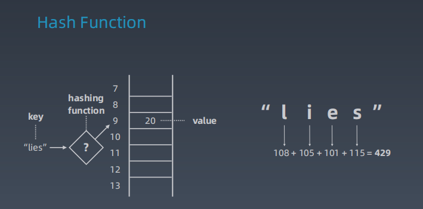
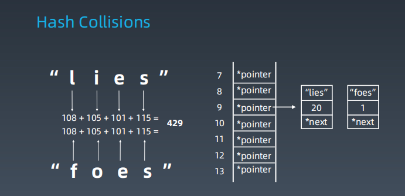
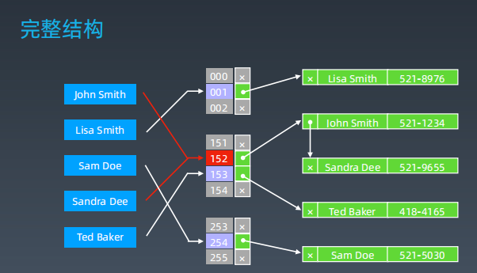

[复杂度分析](https://www.bigocheatsheet.com/)

#### map set 

####  树、二叉树、二叉搜索树
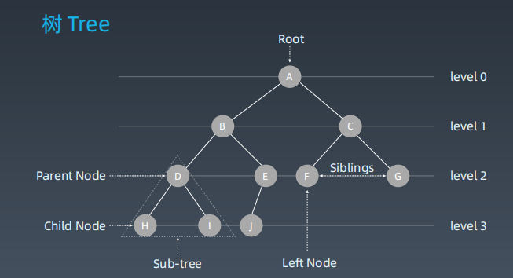
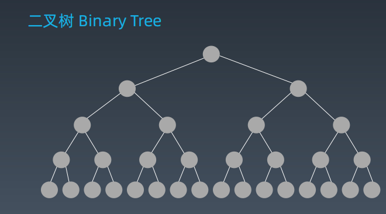
二叉树遍历：  
前序：根-左-右  
中序：左-根-右  
后序：左-右-根  

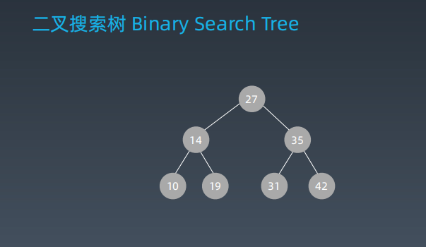
二叉搜索树(有序二叉树、排序二叉树) ，左子树上所有节点均小于它的根节点，右子树上所有节点都大于它的根节点。
中序遍历： 升序排列
[图解](https://visualgo.net/zh/bst)

#### 堆 Heap 二叉堆 Binary Heap
###### 堆
可以迅速找到一堆数中的最大或最小的数据结构。  
大顶堆（大根堆）
小顶堆（小根堆）
###### 二叉堆 
通过完全二叉树来实现。  
满足：  
    是一棵完全树。  
    树中任意节点的值总是>=其子节点的值。
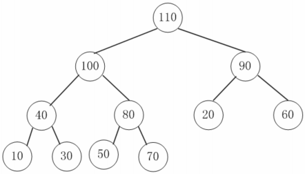

二叉堆实现细节：
二叉堆一般通过’数组‘来实现。
假设第一个元素在数组中的索引为0，父节点和子节点的位置关系如下：
索引i的左孩子的索引为(2*i+1)
索引i的右孩子的索引为(2*i+2)
索引i的父节点的索引为floor((i-1)/2)
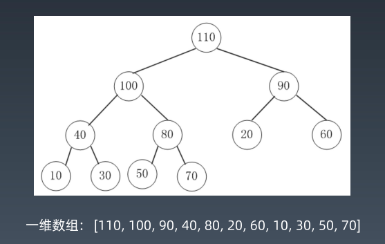

* 插入操作
新元素一律先插入到堆的尾部。
依次向上调整整个堆结构。
* 删除堆顶
将堆尾元素替换到顶部
依次从根部向下调整整个堆结构。

#### 图
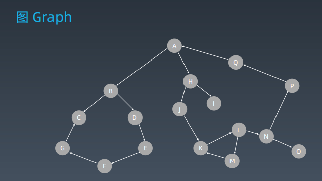
有点有边

V - vertex:点
度-入度和出度
点与点之间 ：联通否

E - edge 边
有向和无向
权重  
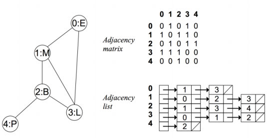
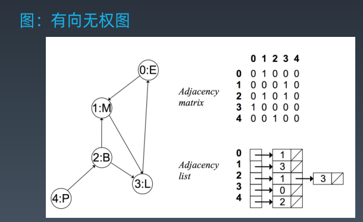
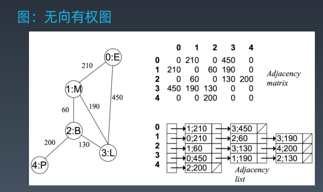
基于图的算法：DFS BFS

[拓扑排序](https://zhuanlan.zhihu.com/p/34871092)
[最短路径](https://www.bilibili.com/video/av25829980?from=search&seid=13391343514095937158)
[最小生成树](https://www.bilibili.com/video/av84820276?from=search&seid=17476598104352152051)

