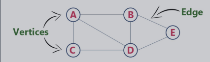

# 第二周学习及总结 
## 学习内容
* 哈希表、映射、集合

#### hash table
哈希表（散列表），根据关键码值（key,value）而直接进行访问的数据结构。
通过把关键码值映射到表中一个位置来访问记录，以加快查找的速度。
这个映射函数叫散列函数，存放记录的数组叫哈希表。
###### 工程实践
* 电话号码簿
* 用户信息表
* 缓存（LRU）
* 键值对存储（Redis）

[复杂度分析](https://www.bigocheatsheet.com/)

#### map set 

####  树、二叉树、二叉搜索树

二叉树遍历：  
前序：根-左-右  
中序：左-根-右  
后序：左-右-根  

二叉搜索树(有序二叉树、排序二叉树) ，左子树上所有节点均小于它的根节点，右子树上所有节点都大于它的根节点。
中序遍历： 升序排列
[图解](https://visualgo.net/zh/bst)

* 堆、二叉堆、图
## 堆 Heap

#### 图

有点有边

