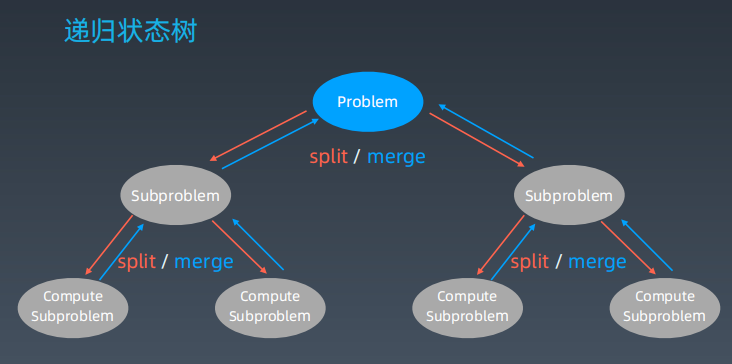

# 学习笔记
## 递归
递归终结条件
处理当前层
下一层

递归-循环，通过函数体来进行的循环。

思维要点：
1，不要人肉递归
2，找到最近最简的问题，重复子问题
3，数学归纳法思维

## 分治、回溯
特殊的递归

#### 回溯
回溯法采用试错的思想，它尝试分步的去解决一个问题。在分步解决问题的过程中，当它通过尝试发现现有的分步答案不能得到有效的正确解答时，它将取消上一步甚至几步的计算，在通过其它的可能的分步解答再次尝试寻找问题的答案。  
回溯法通常用最简单的递归方法来实现，在反复重复上述步骤后可能出现两种情况：
* 找到一个可能存在的正确的答案
* 在尝试了所有可能的分步方法后宣告该问题没有答案。
在最坏的情况下，回溯法会导致一次复杂度为指数时间的计算。

题目：
50，pow(x,n)
78.子集
17.电话号码的字母组合

## 