# 学习笔记

## 动态规划
分治、回溯、递归、动态规划
本质上就是解决递归或分治的问题，有最优子结构。中途淘汰次优解
分治+最优子结构
动态规划和 递归或分治 没有根本上的区别（关键看有无最优子结构）
共性：找到重复子问题
差异性： 最优子结构、中途淘汰次优解

#### 实例 斐波那契数列
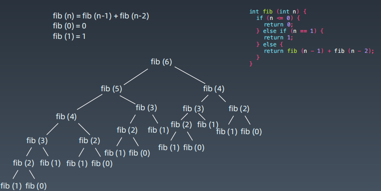
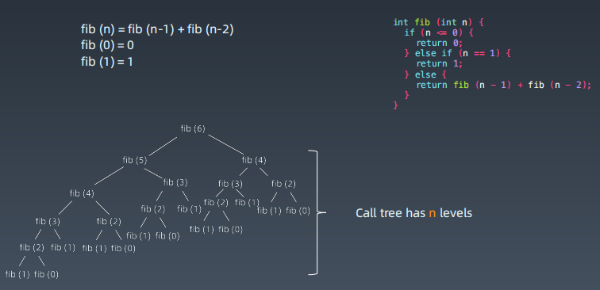
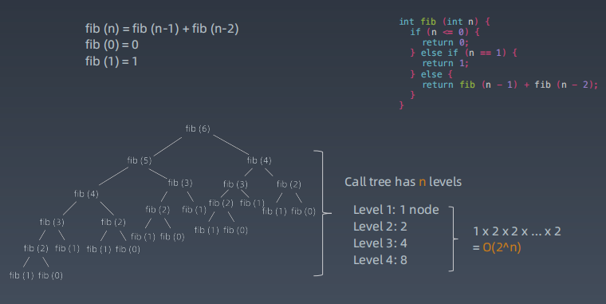
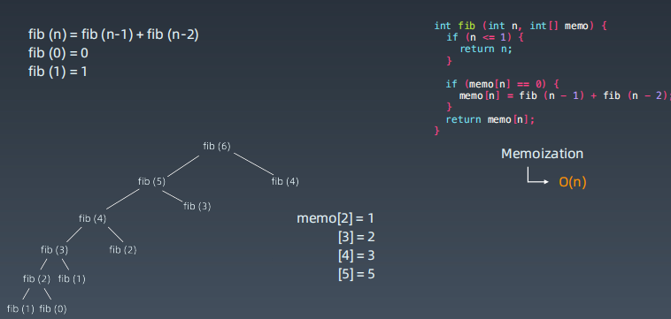
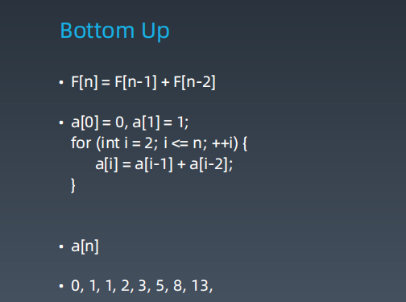

#### 实例 路劲计数
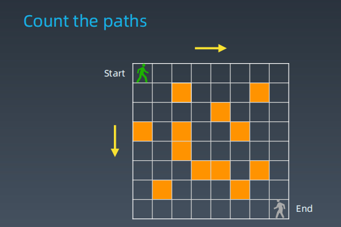
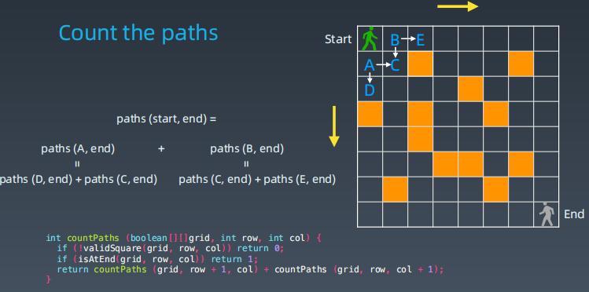
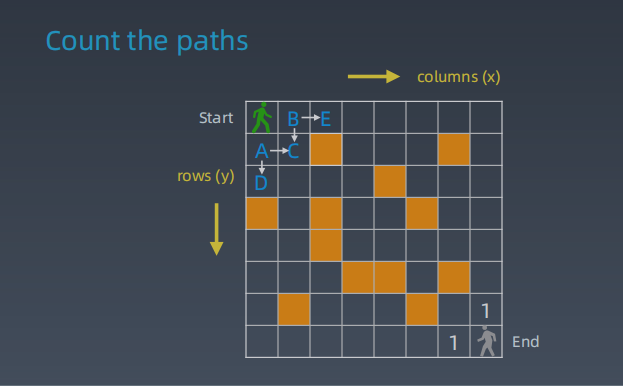
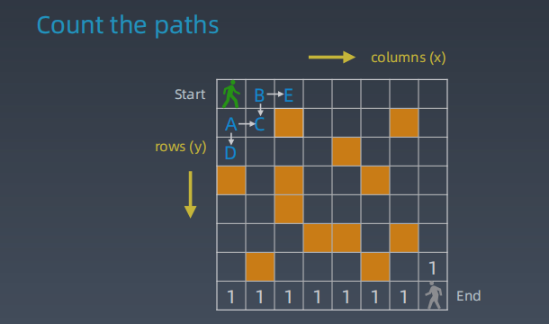
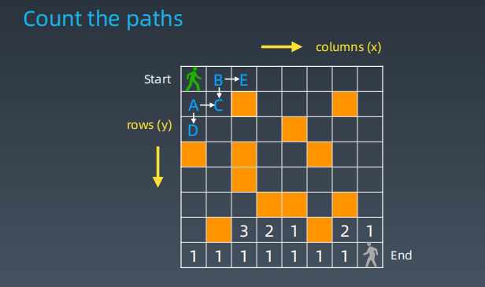
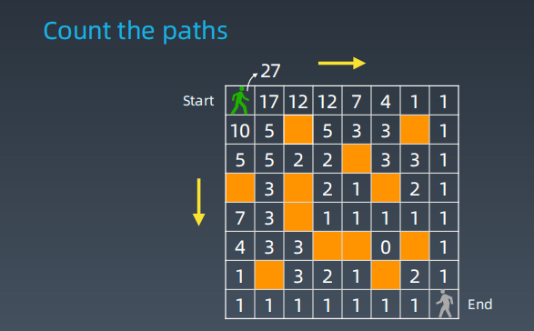
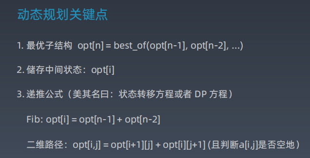

#### 最长公共子序列
[1143. 最长公共子序列](https://leetcode-cn.com/problems/longest-common-subsequence/)

如 ： 
"ABAZDC" , "BACBAD"

字符串问题

1、   
s1 = '';      
s2 = 任意字符串   
2、   
s1 = 'A'   
s2 = 任意字符串   
3、   
s1 = '.....A'  
s2 = '....A'  

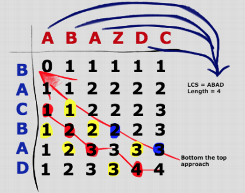
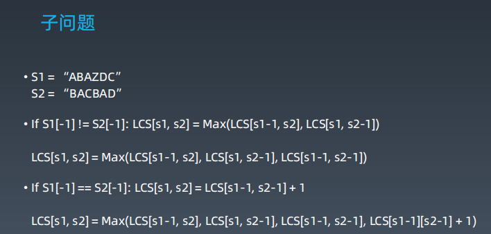
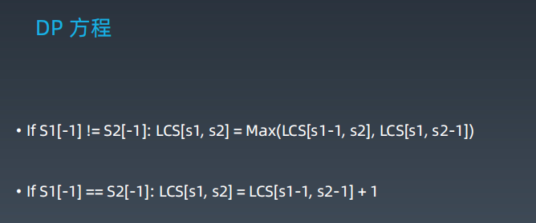

#### 动态规划小结
* 打破思维惯性，形成机器思维
* 理解复杂逻辑的关键
* 职业进阶的要点要领

[B站 ： mit动态规划](https://www.bilibili.com/video/av53233912?from=search&seid=2847395688604491997)
