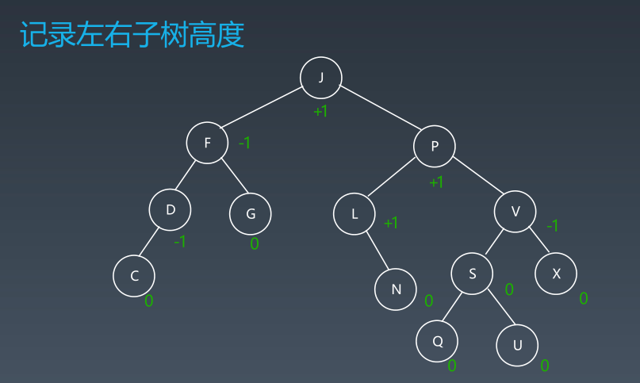
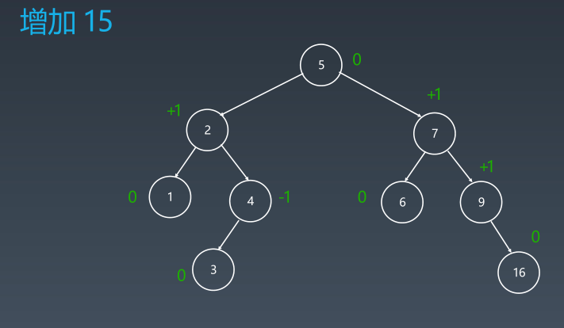

学习笔记
## 字典树和并查集
#### 字典树
* 字典树的数据结构
    tire树（单词查找树或键树）。
    典型应用是用于统计和排序大量的字符串（不限于字符串），经常被搜索引擎系统用于文本词频统计。
    优点： 最大限度的减少无谓的字符串比较，查询效率比哈希表高。
    
* 字典树的核心思想
    空间换时间，利用字符串的公共前缀来降低查询时间的开销以达到提高效率的目的。
* 字典树的基本性质
    - 节点本身不存完整单词
    - 从根节点到某一节点，路径上进过的字符拼接起来，为该节点对应的字符串。
    - 每个节点的所有子节点路径代表的字符都不相同。

#### 并查集
适用场景   
* 组团、配对问题
* group or not 
基本操作：  
* makeSet(s) : 建立一个新的并查集，其中包含s个单元素集合。
* unionSet(x,y) : 把元素x和元素y所在的集合合并，要求x和y所在的集合不相交，如果相交则不合并。
* find(x) : 找到元素x所在的集合的代表，该操作也可以用于判断两个元素是否位于同一个集合，只要将他们各自的代表比较一下就可以了。

## 高级搜索
#### 初级搜索
1、朴素搜索
2、优化方式：不重复（fibonacci）、剪枝（生成括号问题）
3、搜索方向：
    DFS
    BFS
    双向搜索、启发式搜索

#### 剪枝

#### 回溯法
回溯法采用试错的思想，它尝试分步去解决一个问题。在分步解决问题的过程中，当它通过尝试发现现有的分步答案不能得到有效的正确的解答时，它将取消上一步甚至上几步的计算，再通过其它的可能的分步解答再次尝试寻找问题的答案。

回溯法通常用最简单的递归方法来实现，在反复重复上述步骤后可能出现两种情况：

- 找到一个可能存在的正确答案
- 在尝试了所有可能的分步方法后宣告该问题没有答案。
在最坏的情况下，回溯法会导致一次复杂度为指数时间的计算。

#### 双向BFS

#### 启发式搜索 Heuristic Search （A*）

估价函数
启发式函数： h(n) ，它用来评价哪些节点最有希望的是一个我们要找的节点。h(n)会返回一个非负实数，也可以认为是从节点n的目标节点路径的估计成本。

启发式函数是一种告知搜索方向的方法。它提供了一种明智的方法来猜测哪个邻居节点会导向一个目标。

## 红黑树和AVL树
#### AVL树
* Balance Factor(平衡因子)：是它的左子树的高度减去右子树的高度(有时相反)
* 通过旋转操作来进行平衡

+ 旋转操作
    - 左旋
    - 右旋
    - 左右旋
    - 右左旋

[红黑树](https://zhuanlan.zhihu.com/p/63272157)
[动图](https://en.wikipedia.org/wiki/Tree_rotation#/media/File:Tree_Rebalancing.gif)

#### AVL总结
* 平衡二叉搜索树
* 每个节点存 balance factor = {-1,0,1}
* 四种旋转操作
* 【不足】节点需要存储额外信息、且调整次数频繁

#### 红黑树
红黑树是一种近似平衡的二叉搜索树，它能够确保任何一个节点的左右子树的高度差小于两倍。具体来说，红黑树是满足如下条件的二叉搜索树：
* 每个节点要么是红色，要么是黑色
* 根节点是黑色
* 每个叶子节点(NIL节点,空节点)是黑色的
* 不能有相邻接的两个红色节点
* 从任一节点到其每个叶子的所有路径都包含相同数目的黑色节点

关键性质：   
从根到叶子的最长的可能路径不多于最短的可能路径的两倍长。

