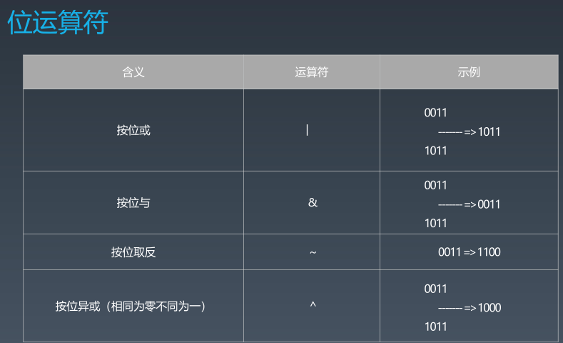

## 位运算
+ 为什么需要位运算？
    - 机器里的数字表示方式和存储格式就是二进制
    - 十进制--二进制转换
    
    
    
    
    

     
## 布隆过滤器
 
 Bloom Filter VS Hash Table   
 一个很长的二进制向量和一系列随机映射函数。   
 布隆过滤器可以用于检索一个元素是否在一个集合中。   
 【优点】空间效率和查询时间远远超过一般的算法。  
 【缺点】有一定的误识别率和删除困难。   
 
 
+ 案例
    - 比特币网络
    - 分布式系统
    - Redis缓存
    - 垃圾邮件、评论的过滤
 [布隆过滤器(Bloom Filter)的原理和实现](https://www.cnblogs.com/cpselvis/p/6265825.html)
 [使用BloomFilter布隆过滤器解决缓存击穿、垃圾邮件识别、集合判重](https://blog.csdn.net/tianyaleixiaowu/article/details/74721877)

 [java实现](https://github.com/lovasoa/bloomfilter/blob/master/src/main/java/BloomFilter.java)
 [java实现](https://github.com/Baqend/Orestes-Bloomfilter)
## LRU缓存
+ cache缓存
 - 记忆
 - 钱包 - 储物柜
 - 代码模块

[参考](https://www.sqlpassion.at/archive/2018/01/06/understanding-the-meltdown-exploit-in-my-own-simple-words/)

+ LRU Cache
    - 两个要素：大小、替换策略
    - Hash Table + Double LinkedList 
    - 查询、修改、更新 O(1)

+ 替换策略
    - LFU -- least frequently used
    - LRU -- least recently used
[替换算法总览](https://en.wikipedia.org/wiki/Cache_replacement_policies)

## 排序算法

+ 比较类排序
    - 通过比较来决定元素间的相对次序，由于其时间复杂度不能突破O(nlogn)，因此也称为非线性时间比较类排序。
+ 非比较类排序
    - 不通过比较来决定元素间的相对次序，它可以突破基于比较排序的时间下届，以线性时间运行，因此也称为线性时间非比较类排序。

+ 初级排序--O(n^2)
    - 选择排序
        每次找最小值，然后放到待排序数组的其实位置。
    - 插入排序
        从前到后逐步构建有序序列；对于未排序数据，在已排序序列中从后向前扫描，找到相应位置并插入。
    - 冒泡排序
        嵌套循环，每次查看相邻的元素，如果逆序则交换。
+ 高级排序-- O(nlogn)
    - 快速排序
        数组取标杆pivot，将小元素放pivot左边，大元素放右侧，然后依次对右边和右边的子数组继续快排；以达到整个序列有序。
    
    - 归并排序 --- 分治
        - 把长度为n的输入序列分成两个长度为n/2的子序列
        - 对这两个子序列分别采用归并排序
        - 将两个排序好的子序列合并成一个最终的排序序列。
    
    
    - 堆排序 -- 堆插入O(logn) 取最大/小值 O(1)
        - 数组元素依次建立小顶堆
        - 依次取堆顶元素，并删除

+ 特殊排序 - O(n)
    - 计数排序
        计数排序要求输入的数据必须是有确定范围的整数。将输入的数据值转化为键存储在额外开辟的数组空间中；然后依次把计数大于1的填充回原数组。
    - 桶排序
        工作原理：假设输入数据服从均匀分布，将数据分到有限数量的桶里，每个桶再分别排序（有可能再使用别的排序算法或是以递归方式继续使用桶排序进行排序）
    - 基数排序
        按照低位先排序，然后收集；再按照高位排序，然后再收集；一次类推，直到最高位。有时候有些属性是有优先级顺序的，先按低优先级排序，再按高优先级排序。
[排序动画](https://www.cnblogs.com/onepixel/p/7674659.html)   
[排序动画](https://www.bilibili.com/video/av63851336)  
[排序动画](https://www.bilibili.com/video/av25136272l)  

+ 归并和快排具有相似性，但步骤顺序相反
    - 归并：先排序左右子数组，然后合并两个有序子数组
    - 快排：先调配处左右子数组，然后对于左右子数组进行排序
