## 高级动态规划
#### 递归、分治、回溯、动态规范
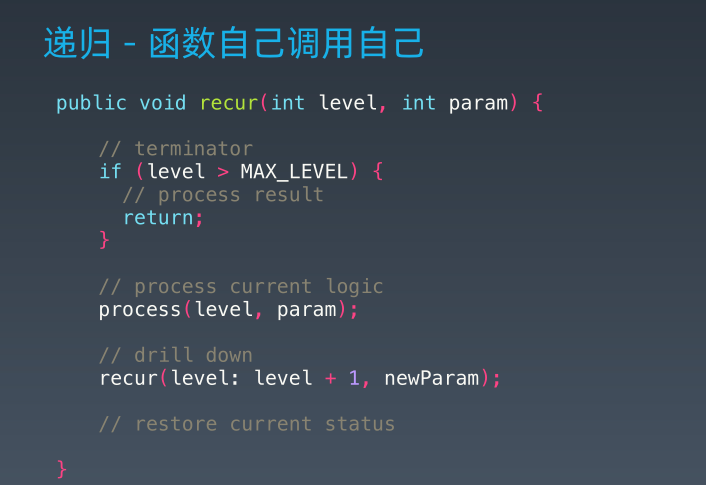
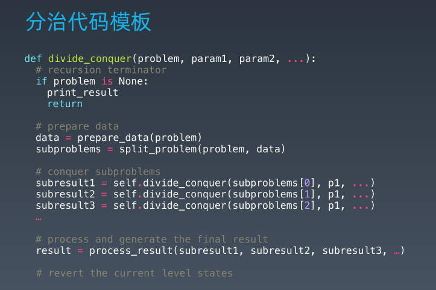
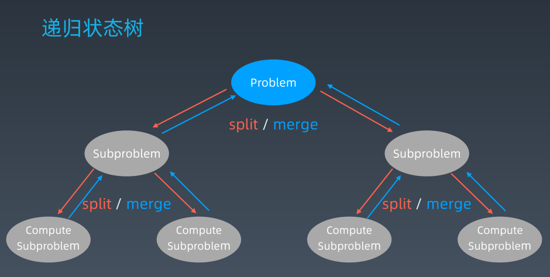
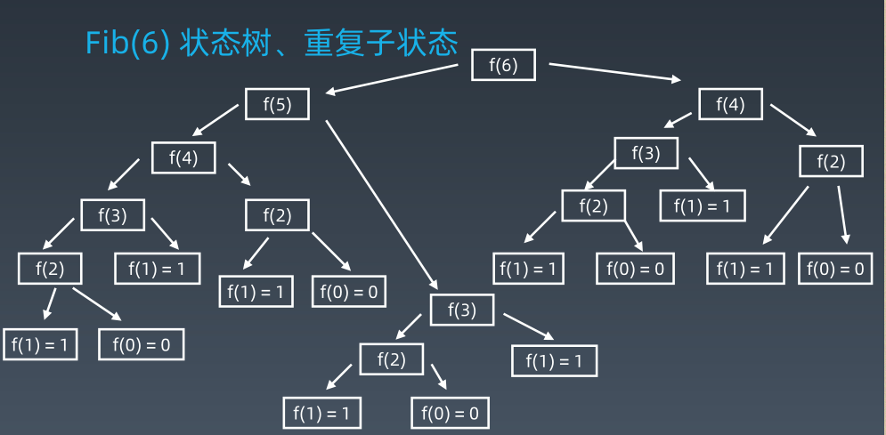
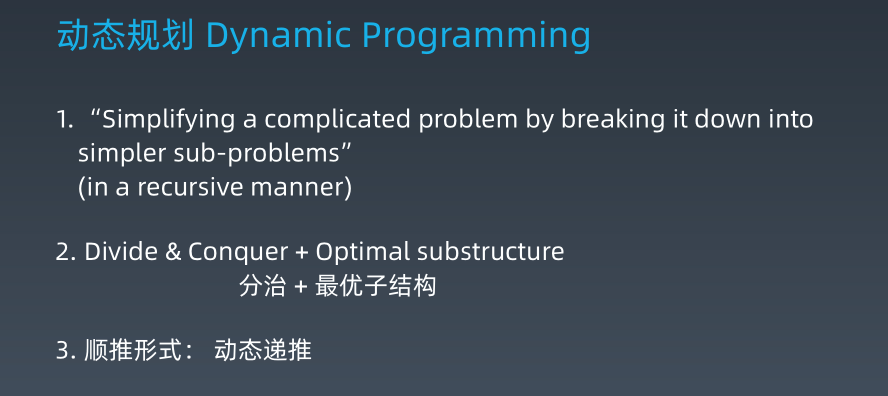
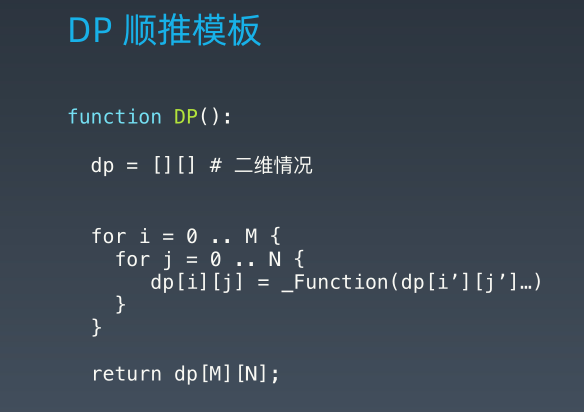
+ 关键点
    - 动态规划和递归或分治没有根本上的区别 （关键看有无最优子结构）
    - 拥有共性：找到重复子问题
    - 差异性：最优子结构、中途可以淘汰次优解
#### 常见的DP题目和状态方程
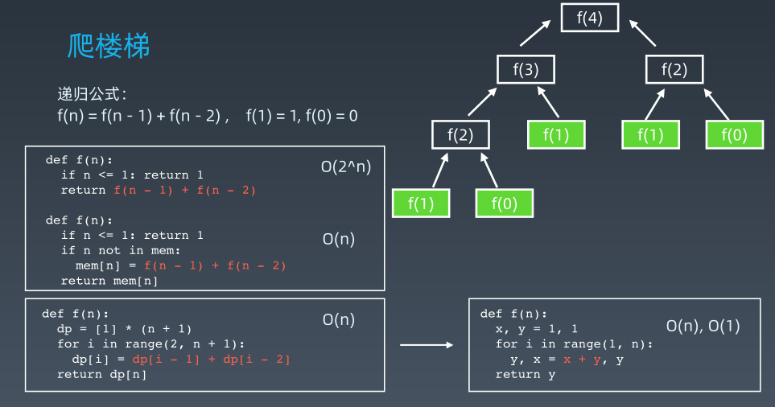
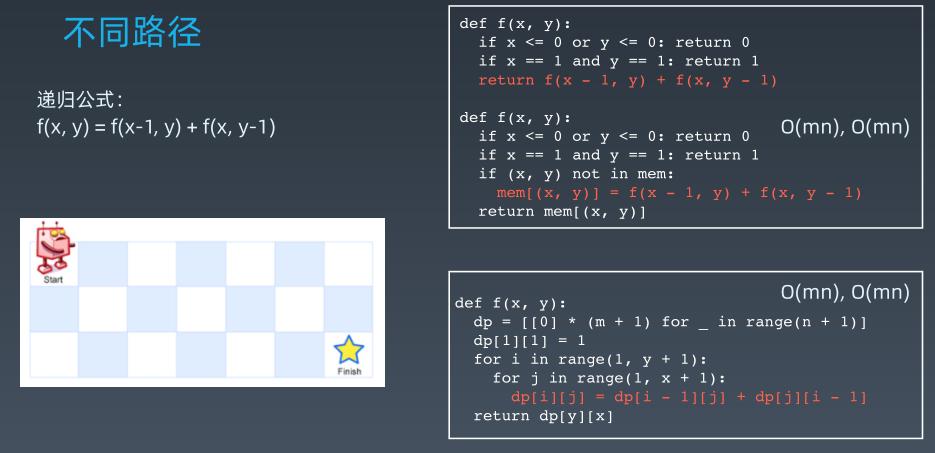
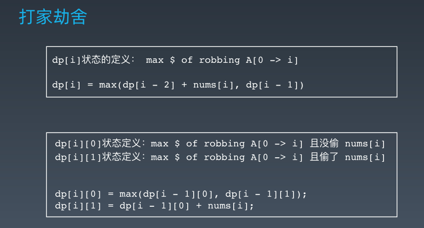
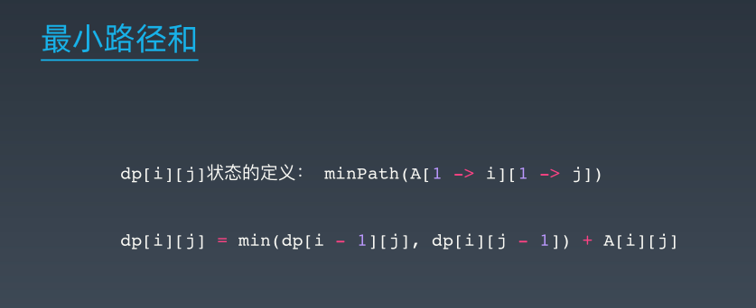
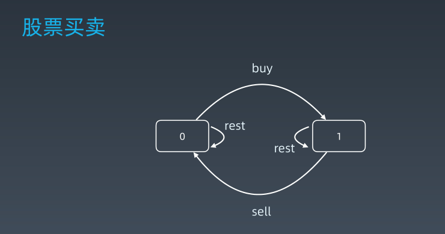 [题解](https://leetcode-cn.com/problems/best-time-to-buy-and-sell-stock/solution/yi-ge-fang-fa-tuan-mie-6-dao-gu-piao-wen-ti-by-l-3/)
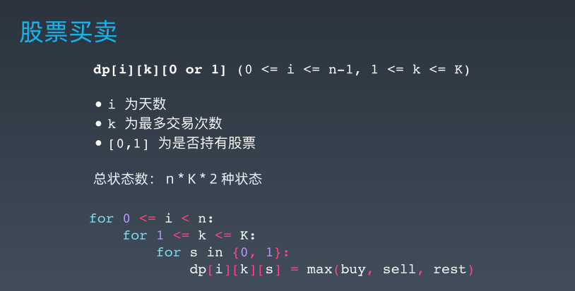
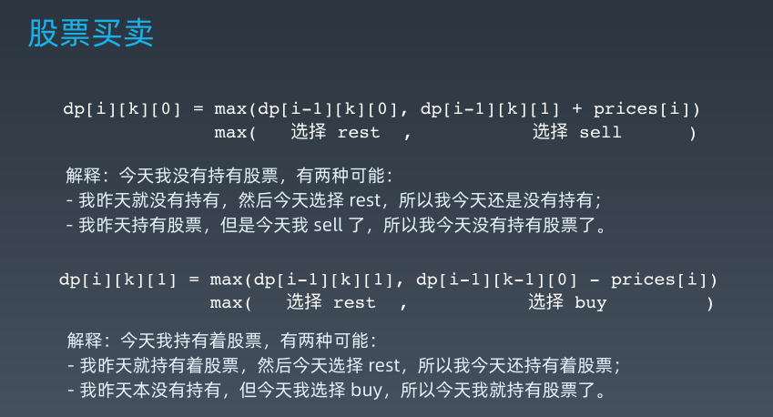
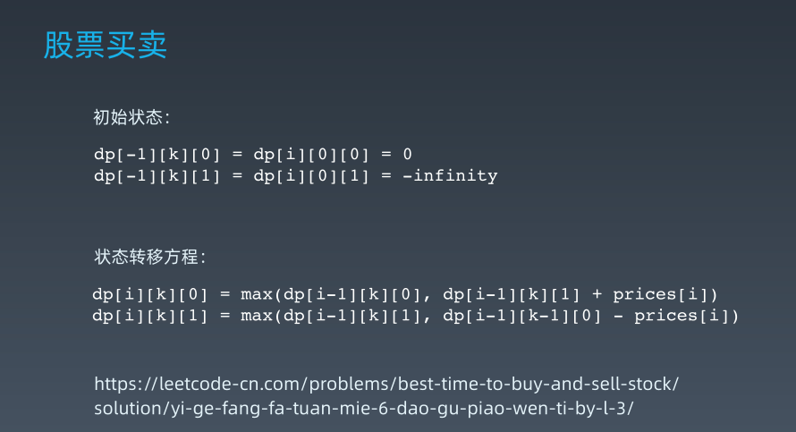

#### 高阶DP问题
+ 复杂度来源
    - 状态拥有更多维度（二维、三维或更多，甚至要压缩）
    - 状态方程更加复杂
    - 本质： 内功、逻辑思维、数学

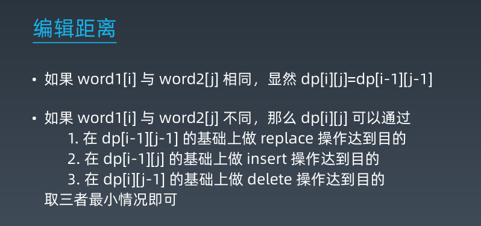

## 字符串算法
[Are your strings immutable?](https://lemire.me/blog/2017/07/07/are-your-strings-immutable/)

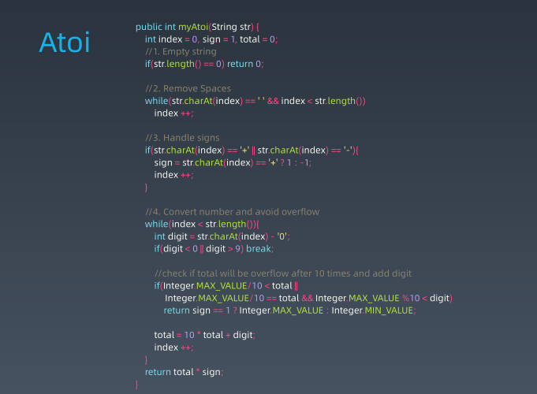

+ 字符串操作
+ Anagram异位词问题
+ Palindrome回文串问题
+ 最长子串、子序列
+ 字符串+递归 or DP
+ 字符串匹配算法
    - 暴力法
    - Rabin-Karp算法
    - KMP算法
    [字符串匹配的Boyer-Moore算法](https://www.ruanyifeng.com/blog/2013/05/boyer-moore_string_search_algorithm.html)
    [字符串匹配之KMP、BoyerMoore、Sunday算法](https://blog.csdn.net/u012505432/article/details/52210975)

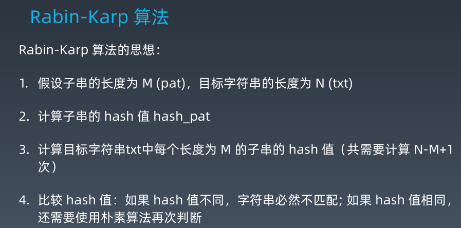
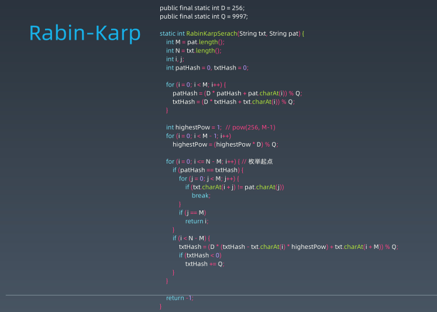

[KMP算法](https://www.bilibili.com/video/av11866460?from=search&seid=17425875345653862171)
[字符串匹配的KMP算法](http://www.ruanyifeng.com/blog/2013/05/Knuth%E2%80%93Morris%E2%80%93Pratt_algorithm.html)

